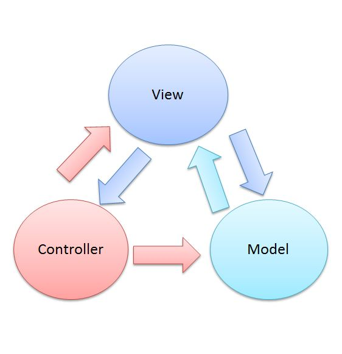

一、生产者消费者框架

1. 消费者生产者框架
框架原理和思路：
数据结构： 队列、消息
一对多： 一个生产者对于多个消费者
通讯模型： 消费者和生产者双向通讯

2.学习资料: 使用面向过程的方法通过LabVIEW实现生产者和消费者框架
框架：

3.实战：使用此框架实现数据采集保存功能

二、基于Actor的生产者消费者

面向对象的思想： 继承、封装、多态、抽象
Actor的思路和模型；
Actor相互调用关系：
Actor之间的通讯：
Actor之间解耦
Actor的使用：
学习视频：https://www.bilibili.com/video/BV1AJ41177dJ

根据以上视频实现功
Actor 学习资料：

10.实战：使用此框架实现数据采集保存功能

三、MVC架构

MVC要实现的目标是将软件用户界面和业务逻辑分离以使代码可扩展性、可复用性、可维护性、灵活性加强。

View层，单独实现了组合模式

Model层和View层，实现了观察者模式

View层和Controller层，实现了策咯模式

思考：如何用LabVIEW 实现MVC框架。

