UML(Unified Modeling Language)，翻译为“统一建模语言”，UML是面向对象领域的大师Grady
Booch、James Rambaugh、Ivar Jacoboson(又称”UML三友”)，在各自已有方法的基础上，博采众长
最终形成的一套面向对象的建模语言。

UML如此流行，以至于在很多时候说起面向对象都会谈到UML，但是很多人误以为掌握了UML就掌握
了设计，设计就是画UML图，这就好比你以为认识了所有的汉字就能写出一部好的小说作品一样。它
只是一个语言工具，可以帮助我们去表达思想和交流，设计其实是一个创造的过程，而不是单纯的表达
的过程，只有设计出来后才可以用UML进行表达。

UML在面向对象领域很重要，是因为在面向对象领域也经历了多种语言的时代，如Booch、OOSE、
OMT，多种语言共存给开发者带来了较大的负担，他们需要掌握多种语言才能正常交流，考虑到多语
言的不便，UML三友才决定将各自的成果融合提炼，最后推出了UML，它实现了面向对象领域语言的
统一，大大提高了全世界所有程序员进行信息交流的准确性和有效性。

UML作为全世界通用的程序领域的建模语言，有一套定义非常严格和专业的术语及规范，涉及到的内
容非常多，如需深入学习掌握需要参考专业书籍，这里暂且只简单介绍其中的UML类图，以便我们能
够看懂别人给出的类图，以及向他人表达我们自己的设计。

类图顾名思义是表示类的图，类图主要包括两部分：类定义和类之间的关系。

1. 类图定义

类定义图包含三部分：类名称、属性区、方法区，这个与代码中类的结构基本一致。如下图定义的一个
简单类图，最上面“Student”是类名，中间是属性，最下面是方法。

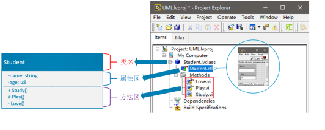

类图中有几个地方需要注意。

1. 类成员可见性
加号(+)表示Public，公共的，如上图的Study()方法；
减号(-)表示Private，私有的，如上图的name和age；
井号(#)表示Protected，包含的，如上图的Play()方法；

2. 属性类型表示

属性的类型表示跟在属性名称后面，中间用冒号(:)隔开，当然你也可以不表示出来，不过这并不推
荐。

3. 抽象的表示

抽象的类名或方法，用斜体表示。 LabVIEW2020增加了接口特性，这里提一下接口的表现方式，接口可以看作是一个特殊的类，只不过 这个类没有属性，只有抽象方法。在UML较早的版本中，是通过<>标记来表示的，如下图 所示：
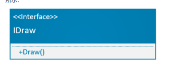

接口还有另外一种目前比较流行的表示法：棒棒糖表示法，如下图所示：
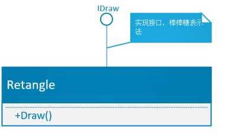

2. 类关系图

类关系图包含“依赖”、"关联”、“聚合”、”组合”、“实现”、”继承”六种，关系紧密程度从紧到松依次为：
继承 > 实现 > 组合 > 聚合 > 关联 > 依赖。不同关系的连线外观也有所体现：实线 > 虚线，实心 > 空
心，如下图所示：
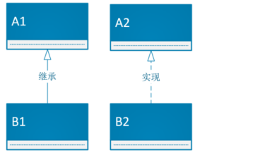

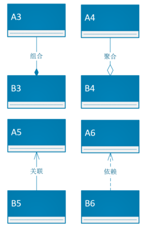

这6种关系按照紧密程度又可以分为以下3组：
使用关系：即B类调用了A类中的方法，包括”关联关系”和”依赖关系“。
包含关系：即B类和A类是整体-部分的关系，B类中包含A类，也称作“has-a”关系，包括”组合关
系“和”聚合关系”。
血缘关系：即B类属于A类，也叫作”is-a"关系，包括“继承关系”和”实现关系”。
每组关系中的两种关系有些细微差别，下面稍作解释帮助理解这些类关系。

2.1 继承

UML中的继承关系就是我们通常说的类继承的概念，用带空心三角形箭头的实线表示，由子类指向父
类。
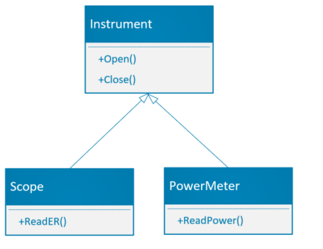

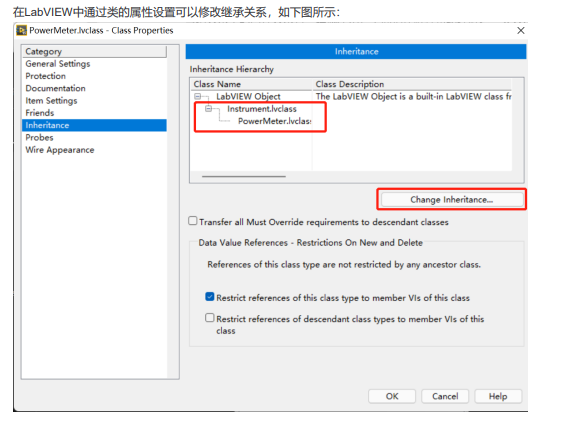

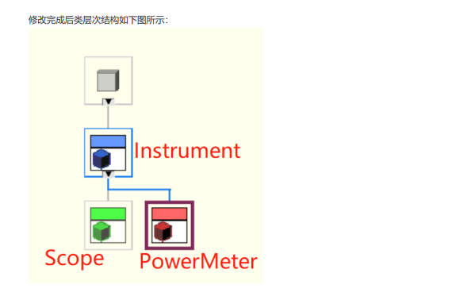

2.2 实现

“实现”是”继承”的一种特殊实现，即当一个类继承某个接口的时候，我们称为“实现”。用带空心三角形箭
头的虚线表示。接口在LabVIEW2020及更高版本才有。

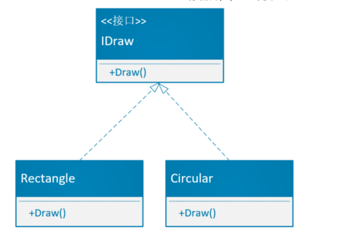

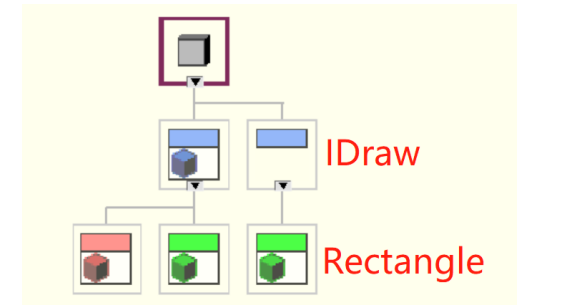

2.3 组合与聚合

组合关系和聚合关系关注的都是一种”整体-部分”的关系，比如汽车由发动机、车轮、车身、制动系统等
组成，那么汽车和发动机、车轮、车身等就是“整体-部分”的关系，而汽车与车牌就不是，它们是关联关
系。虽说这两种关系都是关注的”整体-部分”关系，但是两种体现的程度并不一样：
聚合--是一种“has a"的关系，即一个类包含又另外一个类，但它们的对象生命周期可以不一样，当”整
体”销毁掉后，“部分”依旧可以继续存在。比如汽车的例子，汽车包含发动机，汽车坏了，发动机不一定
就坏了，还可以拆出来给其它汽车继续使用，所以它们之间是一种聚合关系。
组合--是一种”owns a"的关系，即某个类包含另外一个类，但是它们的对象生命周期是一样的，当“整
体”销毁后，”部分”也一同被销毁。比如一课树包含树根、树枝、树叶等，如果树死了，树根、树枝、树
叶等全部也会死掉，所以它们之间是一种组合关系。
聚合关系用带有空心菱形的实线表示，如下图所示：
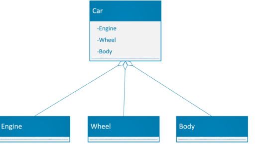
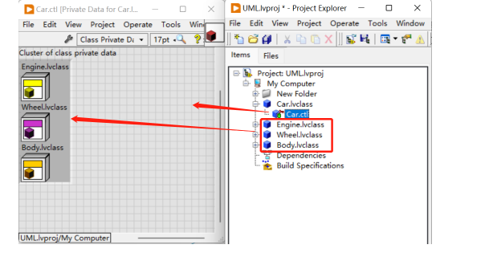

组合关系用带有实心菱形的实线表示，如下图所示：
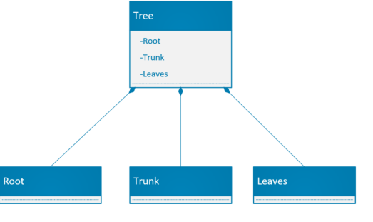

代码的表现形式与上述相同，至于使用哪种关系来描述就要看我们对类之间关系的理解了，一开始想做
到完全正确也并不是那么容易。

2.4 关联与依赖

关联顾名思义就是指两个类之间有关系、有联系。但是这种关系过于宽泛，看似很好理解其实很难判
定。通常会使用排除法：如果两个类有关系，先看看它们是否是包含关系(组合关系、聚合关系）和血
缘关系(继承关系、实现关系)，这两组关系与使用关系差别比较明显，很容易排除，接下来就只需要排
除是否是“依赖关系”了。”关联关系”和“依赖关系”的典型区别就是关联关系会”持有实例”。
关联关系用带有箭头的实线表示，A类持有B类实例，会使用B类的公共方法，如下图所示：
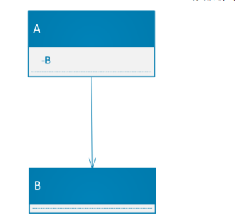

在LabVIEW中的代码呈现形式与包含关系(组合和聚合)类似，但A类和B类并不是“整体-部分”的关系，
如下图所示：
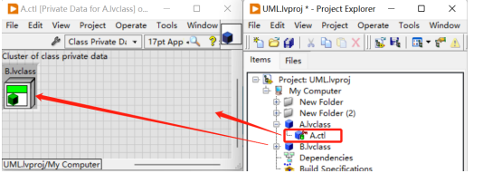

依赖关系用带箭头的虚线表示，A类不持有B类实例，但是会在方法中直接使用B类，如下图所示：
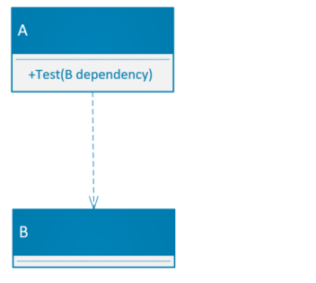

在LabVIEW中代码呈现方式如下图所示：

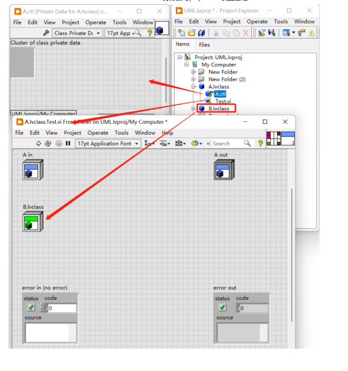