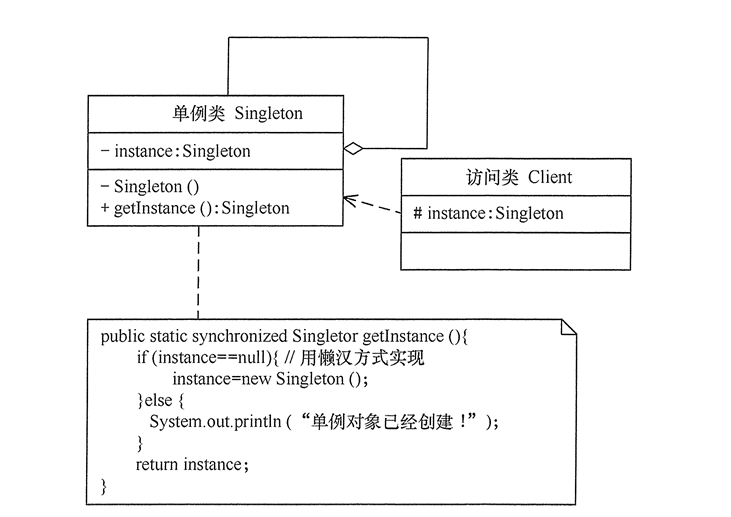
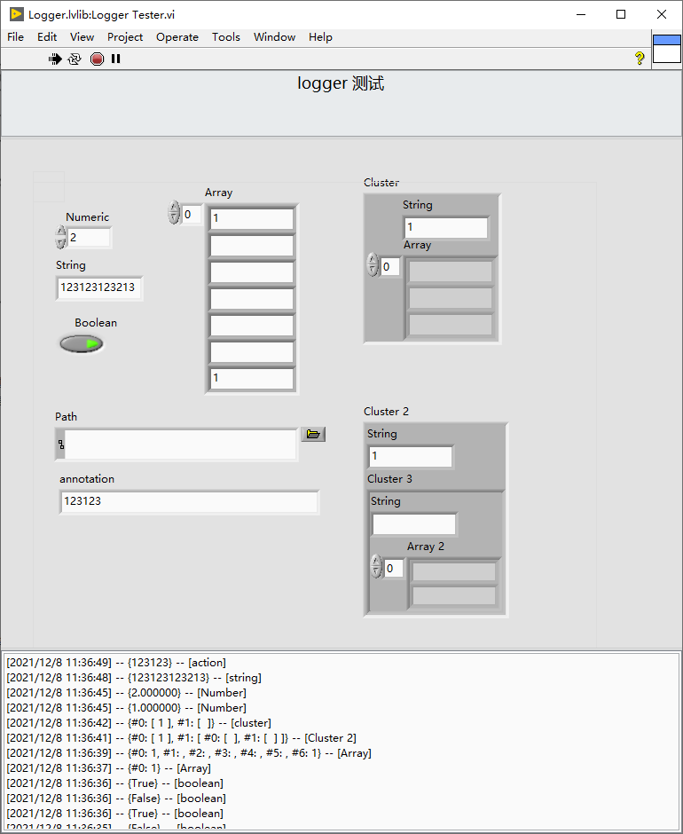
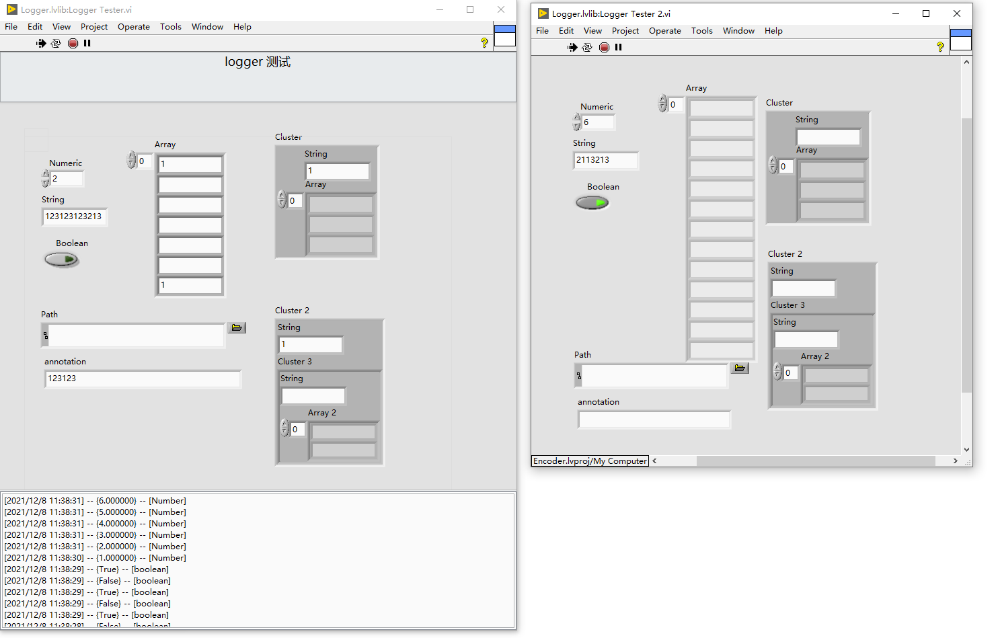

1.什么是单例模式？
单例模式是一种常用的软件设计模式，其定义是单例对象的类只能允许一个实例存在。

许多时候整个系统只需要拥有一个的全局对象，这样有利于我们协调系统整体的行为。

单例的实现主要是通过以下两个步骤：

将该类的构造方法定义为私有方法，这样其他处的代码就无法通过调用该类的构造方法来实例化该类的对象，只有通过该类提供的静态方法来得到该类的唯一实例；
在该类内提供一个静态方法，当我们调用这个方法时，如果类持有的引用不为空就返回这个引用，如果类保持的引用为空就创建该类的实例并将实例的引用赋予该类保持的引用。
2.单例模式场景使用

需要频繁实例化然后销毁的对象。（比如对仪器的频繁打开）

创建对象时耗时或者资源消耗过多，但又经常用到的对象。

有状态的工具类对象。

频繁访问数据库活文件的对象。

3.实战-日志记录模块
几乎每个系统都会使用到 日志记录模块，日志记录模块的设计满足单例设计模式，日志记录模块功能如下：

1.记录系统操作的所有日志到loggger.txt 文件中；

2.在程序的每个模块都会涉及到使用该模块；

3.日志记录需要兼容各种数据类型；

4.可以实时显示日志记录的数据；

4.演示
4.1 兼容各种数据类型
 

4.2 兼容多模块写入同一个数据文件

5.LV -代码参考

Logger.rar

（此代码可使用到程序中，此实现方法作为一种参考实现）

