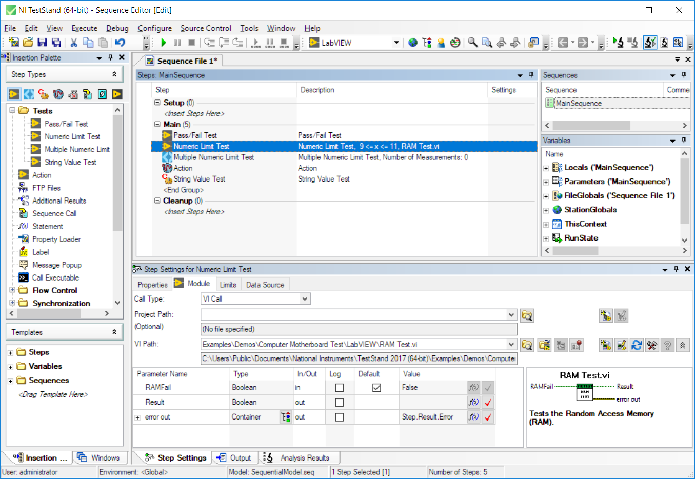
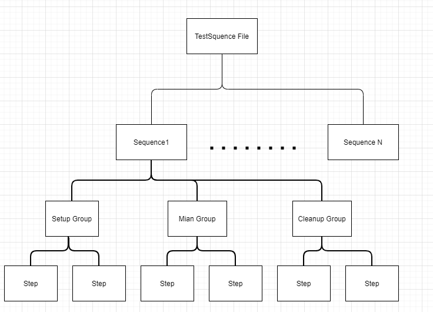
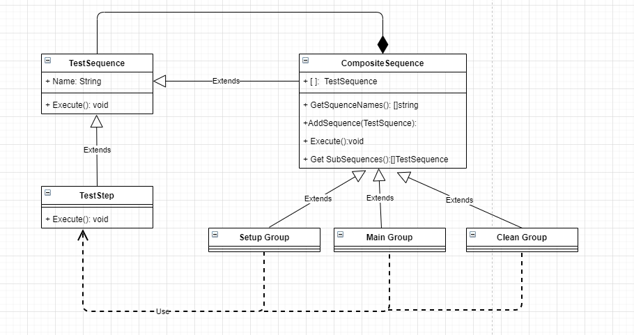
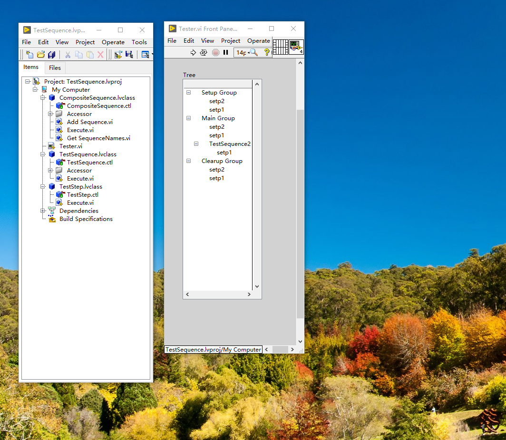

1.设计模式源自于生活
在实际生活中，有很多的场景使用的是组合模式。

场景1：A同学是酷爱电子产品的玩家，购买标配的电脑无法满足他的使用，于是A同学在京东上购买了主板、硬盘、显卡、内存条、显示器、键盘，A同学花了一天的时间完成了组装电脑，一次就成功，成就感十足，玩游戏使用的是自己组装的电脑。

一年后，随着游戏的升级，A同学玩游戏时发现电脑有点卡顿了，经过一天的折腾，发现游戏已经升级了好几个版本，官方为了提升画质，对于硬件的性能也需要提升，为了更好的体验，需要将显卡进行替换。更换了新的显卡，A同学的玩游戏也恢复流畅。

场景2：在测试测量软件中，如果使用过Teststand，每一个测试集合可以由不同的测试序列组成，每个测试序列可以有不同的测试步骤组成。通过灵活的组合方式实现用户自定义测试序列，来满足不同场景自动化测试序列的开发。

对于场景1和场景2，大家可以思考一下，如何实现上述两个场景的功能?

2.从TS测试序列思考组合模式
2.1 什么是组合模式
将对象组合成树形结构以表示“整合-部分”的层次结构关系，组合使得用户对单个对象和复合对象的使用具有一致性。组合模式使得用户对单个对象和组合对象的使用具有一致性，使用组合对象就像使用一般对象一样，不用关系内部组织结构。

2.2 组合模式的设计思想
测试集合TestSequenceFile由多个测试序列sequence组成，每个sequence由setup组、main组和cleanUp组 组成，每个组可以由多个step组成。通过最小元素是step组成，把sequence、step ，以部分-整体的层次结构的设计模式为组合模式。

测试序列的具有明显的部分和整体的关系，复合组合方式的使用，sequence 、step 之间的组合关系如下图所示。

2.3 通过Teststand 分析如何使用组合模式实现

测试序列组合关系图

2.4 UML 
测试序列的基于组合设计模式关系实现的UML图。

3.代码实现
3.1python实现

3.2LabVIEW代码实现

(看附件)

