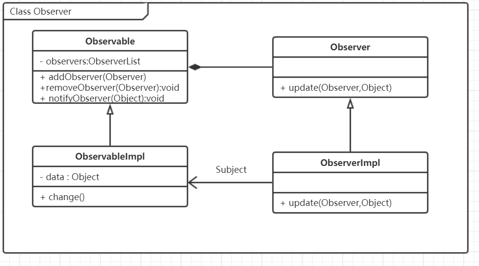

一种一对多的依赖关系，当对象状态发送改变时，所有依赖它的对象都会被通知并自动更新。

1.设计模式源自于生活
生活场景，智能热水器，现在开始烧水泡茶：

开始烧水，然后去洗杯子，准备茶叶；
水烧开后，会自动通知，然后可以泡茶；
可以一边喝茶，一边 吃鸡了；
当水温低于90度后，热水器自动加热，保证随时水的温度不低于泡茶的温度；
大家可以想象一下，如何实现这些功能？

从泡茶剧情中思考监听模式
什么是监听模式
一种一对多的依赖关系，当对象状态发送改变时，所有依赖它的对象都会被通知并自动更新。

有任意个观察者对象同时监听某一个对象；

监听的对象叫观察者Observe；
被监听的对象叫被观察者 Observable\ Subject；
被观察者在内容上发生变化时，会通知所有的观察者，观察者做出相应的响应；
监听模式的设计思想
监听模式的核心：观察者和被观察者之间建立一种自动触发的关系；

观察者模式
发布\订阅模式
设计模式的模型抽象




Labview 代码框架实现


Python 代码框架实现

```python
from abc import ABCMeta,abstractmethod

class Observer(metaclass=ABCMeta):
    """ 观察者父类"""

    @abstractmethod
    def update(self,observable,object):
        pass


class Observable:
    """ 被观察者父类"""
    def __init__(self):
        self.__observers=[]

    def addObserver(self,observer):
        self.__observers.append(observer)
    
    def removeObserver(self,observer):
        self.__observers.remove(observer)
    
    def notifyObserver(self,object=0):
        for o in self.__observers:
            o.update(self,object)

```

Python 功能实现

```python
class WaterHeater(Observable):
    def __init__(self):
        super().__init__()
        self.__temperature=25
    
    def getTemperature(self):
        return self.__temperature
    
    def setTemperature(self,temperature):
        self.__temperature=temperature
        print("current temperature is : "+str(self.__temperature)+"℃")
        self.notifyObservers()


class TeaMode(Observer):
    def update(self,observable,object):
        if isinstance(observable,WaterHeater) and observable.getTemperature()>=90 :
            print('可以泡茶了...')


class GameMode(Observer):
    def update(self,observerable,object):
        if isinstance(observerable,WaterHeater):
            if observerable.getTemperature()>95:
                print("玩累了，水已开，可以喝茶了.")
            else:
                print("水还没有开，请继续Game.")

if __name__ == '__main__':
    
    heater = WaterHeater()
    teamode = TeaMode()
    paly = GameMode()

    heater.addObserver(teamode)
    heater.addObserver(paly)
    heater.setTemperature(40);
    heater.setTemperature(60)
    heater.setTemperature(100)

```
