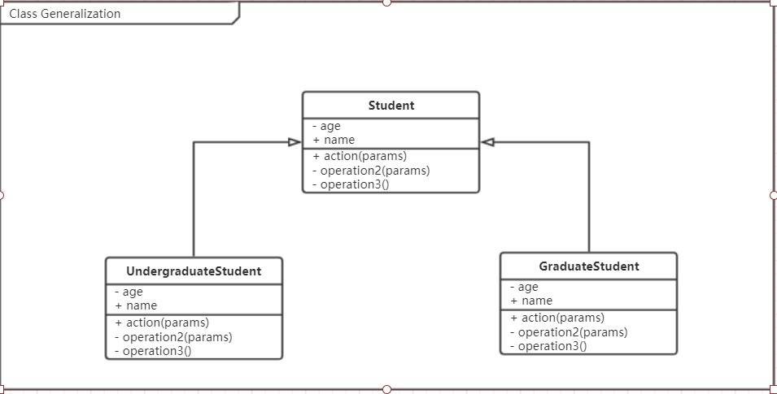
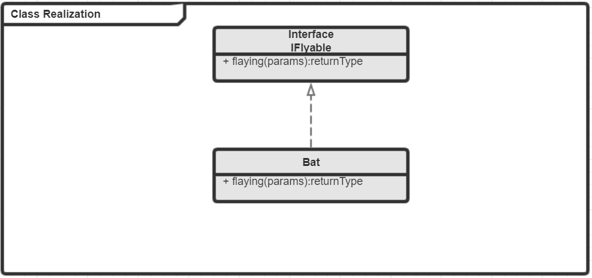
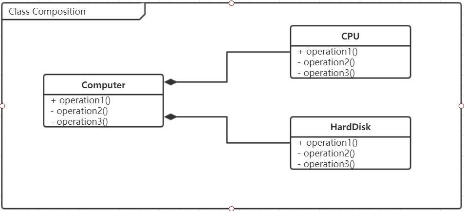
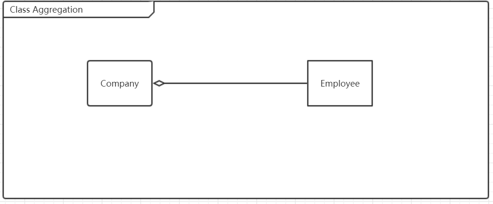
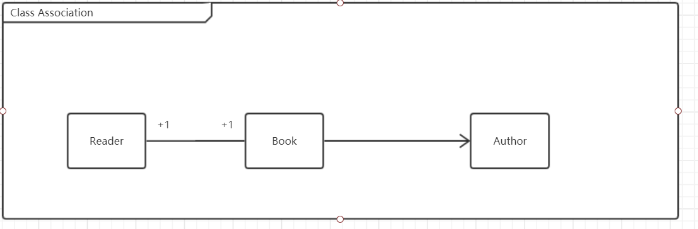

Unified Modeling Language 统一建模语言

类之间的关系
泛化（继承）
属于一种继承关系
使用实线+三角空心箭头表示关系

实现关系（接口）
接口→ 实现
虚线+三角空心箭头表示关系

组合
表示整体和部分的关系，部分离开整体后无法单独存在；
实线+实心菱形表示

聚合
表示整体和部分的关系，部分离开整体后可单独存在；
实线+空心菱形表示

关联
表示拥有关系，一个类知道另一个类的方法和属性，有单向和双向的。
用来表示一对一，一对多；
实线+箭头

依赖
表示一种使用关系，一个类的实现需要另外一个类的协助
虚线+箭头

