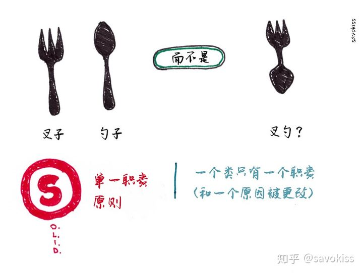
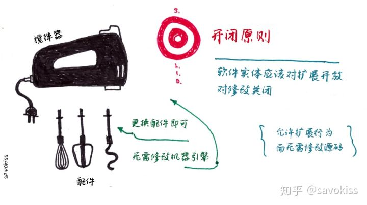
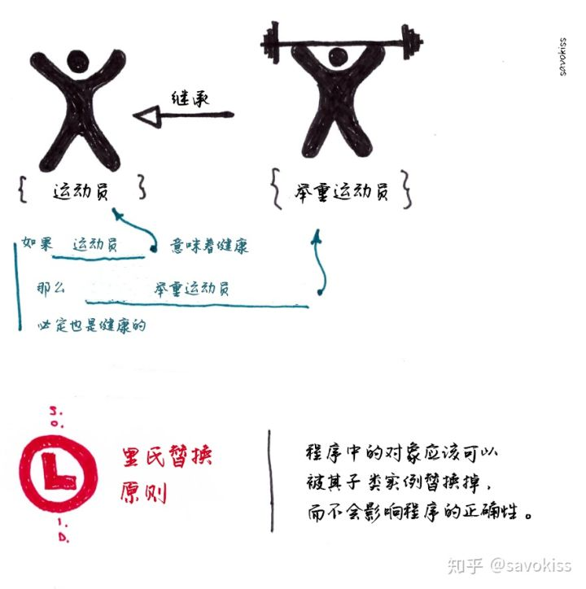
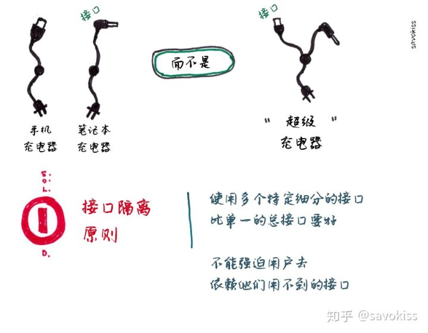
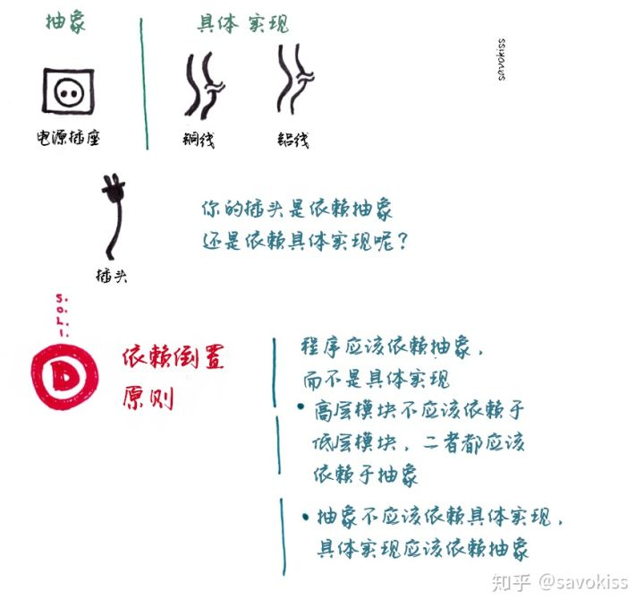

SOLID

1.单一原则
Single Responsibility Principle ：认为对象应该仅具有一种单一功能，一个对象主要负责一个任务；

2.开闭原则
Open Close Principle，软件体应该是对于扩展开放的，但是对于修改封闭的;

  软件实体应该是可扩展，而不可修改的。也就是说，对扩展是开放的，而对修改是封闭的。这个原则是诸多面向对象编程原则中最抽象、最难理解的一个。

3.里氏替换原则
Liskov Substitution Principle，程序中的对象应该是可以在不改变程序正确性的前提下被它的子类所替换的。

4.接口隔离原则
不能强迫用户去依赖那些他们不使用的接口。换句话说，使用多个专门的接口比使用单一的总接口总要好。

5.依赖倒置原则
1. 高层模块不应该依赖于低层模块，二者都应该依赖于抽象
2. 抽象不应该依赖于细节，细节应该依赖于抽象

